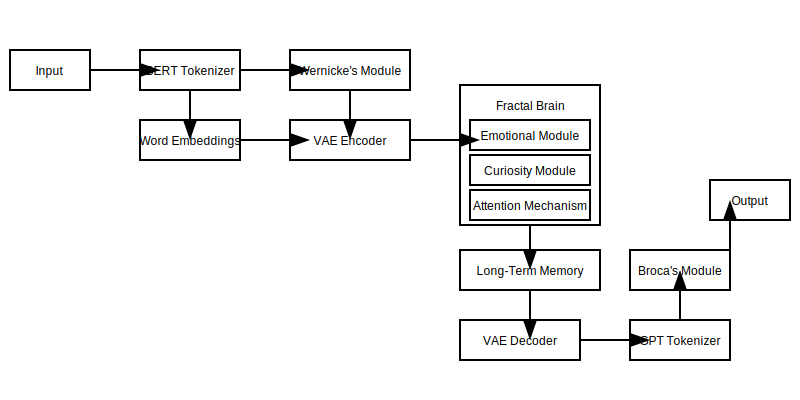

# Fractal Brain
(Sorry for the hype. The readme was written mainly by ChatGPT)
(Dont expect it to talk folks. Perhaps if you tweak the amount of layers, mess with the vae - the bert - tokenization
basically - if you rewrite it to GPT lol) Ah. There went week and a half. 

An advanced AI model implementing a fractal neuron architecture with enhanced modules for emotion, curiosity, and explainability. The Fractal Brain integrates components like BERT and GPT-2 for language understanding and generation, respectively, and employs a Variational Autoencoder (VAE) for latent space encoding.

# Purpose

To see how artificial neurons fire as the AI model is fed text. It is very possible that it will not learn to speak. But think of it as a 
very advanced tamagochi. 

## Table of Contents
- [Introduction](#introduction)
- [Features](#features)
- [Architecture Overview](#architecture-overview)
- [Installation](#installation)
  - [Prerequisites](#prerequisites)
  - [Steps](#steps)
- [Usage](#usage)
  - [Chat Interface](#chat-interface)
  - [Think Mode](#think-mode)
  - [Training on Q&A Pairs](#training-on-q-and-a-pairs)
  - [Saving and Loading State](#saving-and-loading-state)
- [Components](#components)
  - [Broca's Module](#brocas-module)
  - [Wernicke's Module](#wernickes-module)
  - [Fractal Neuron](#fractal-neuron)
  - [Fractal Brain](#fractal-brain)
  - [Emotional Module](#emotional-module)
  - [Curiosity Module](#curiosity-module)
  - [Explainability Module](#explainability-module)
  - [Variational Autoencoder (VAE)](#variational-autoencoder-vae)
  - [Long-Term Memory](#long-term-memory)
  - [Adaptive Learning Rate](#adaptive-learning-rate)
  - [Continuous Learner](#continuous-learner)
- [Dependencies](#dependencies)
- [Limitations](#limitations)
- [License](#license)
- [Contributing](#contributing)
- [Acknowledgments](#acknowledgments)

## Introduction
Fractal Brain is an experimental AI model that simulates a brain-like architecture using fractal neurons and enhanced modules for emotional modulation, curiosity, and explainability. It integrates state-of-the-art NLP models like BERT and GPT-2 for language comprehension and generation.

The goal of this project is to explore novel AI architectures inspired by biological neurons and to create an AI that can learn continuously, adapt, and provide explanations for its outputs.

## Features
- **Fractal Neuron Architecture**: A recursive neural network structure that grows and prunes itself dynamically based on activity.
- **Emotional Modulation**: Incorporates an emotional module that influences processing based on simulated emotions.
- **Curiosity Module**: Evaluates novelty in inputs and encourages exploration and learning of new information.
- **Explainability**: Provides explanations for its responses by highlighting influential neurons and internal processes.
- **Integration with BERT and GPT-2**: Uses pre-trained models for language understanding and generation.
- **Variational Autoencoder (VAE)**: Encodes inputs into a latent space for efficient processing and reconstruction.
- **Long-Term Memory**: Stores experiences and retrieves relevant information during processing.
- **Adaptive Learning Rate**: Adjusts the learning rate dynamically based on performance and novelty.
- **Continuous Learning**: Implements a buffer to learn from new experiences over time.
- **Gradio Interface**: Interactive web interface for chatting and experimenting with the model.

## Architecture Overview



The Fractal Brain architecture consists of multiple interconnected modules:
- **Input Processing**: Tokenization and embedding of input text using BERT and custom embeddings.
- **Comprehension (Wernicke's Module)**: Understanding of intents and entities from the input.
- **Latent Space Encoding (VAE)**: Encoding input embeddings into a latent representation.
- **Fractal Brain Processing**: Recursive processing through fractal neurons influenced by emotional and curiosity modules.
- **Response Generation (Broca's Module)**: Generating responses using GPT-2 based on processed information.
- **Explainability**: Generating explanations for the AI's responses.

## Installation
### Prerequisites
- Python 3.7 or higher
- PyTorch (with CUDA support if using GPU)
- Git (for cloning the repository)
### Steps
#### Clone the repository
```bash
git clone https://github.com/yourusername/fractal-brain.git
cd fractal-brain
```

#### Create a virtual environment (optional but recommended)
```bash
python -m venv venv
source venv/bin/activate  # On Windows use `venv\Scripts\activate`
```

#### Install the required packages
```bash
pip install -r requirements.txt
```

#### Download necessary data
The script will automatically download the WikiText103 corpus and GloVe embeddings when run for the first time.

## Usage
Run the main script to start the Gradio interface:
```bash
python fractal_brain.py
```
This will launch a web interface where you can interact with the model.

### Chat Interface
- **Your Message**: Input text to chat with the AI.
- **Temperature**: Adjust the randomness of the AI's responses. Higher values produce more creative outputs.
- **AI Response**: View the AI's reply, including its thinking process and explanations.

### Lm Studio interaction
- Start LM studio, load a model in server mode, start server.
- Put in initial message for LM Studio (Good idea to say what is happening, ie you are talking with AI that has yet to learn to speak)
- Choose conversation duration and time between the messages
- I have not tried this with more than one version of LM Studio, it does work on mine.
- You might have to change the AI model name to fit yourse in the LM Studio, but on mine it works even when I do not change it.

Deepdive to the LM Studio - Fractal brain interaction: 

## Handling of LM Studio Messages and Prevention of Parroting

## Overview
Our AI model is designed to engage in conversations with LM Studio without simply parroting or repeating LM Studio's messages. 
This is achieved through a series of processing steps that abstract and reinterpret the input messages, ensuring that the AI 
generates original responses based on its internal understanding and reasoning.

Processing Pipeline
When the AI receives a message from LM Studio, it undergoes several transformations:

Input Text Tokenization: The message is tokenized using the BERT tokenizer, converting it into a sequence of tokens.

Word Embeddings: The tokens are converted into embeddings—numerical vectors representing semantic information.

Variational Autoencoder (VAE) Encoding: The embeddings are passed through the VAE encoder, compressing them into a lower-dimensional latent
space representation (latent vector).

Fractal Brain Processing: The latent vector is processed by the Fractal Brain, which applies complex transformations, including emotional
modulation, attention mechanisms, and recursive neural processing.

VAE Decoding: The processed latent vector is passed through the VAE decoder, reconstructing it back into the embedding space.

Embedding to Text Conversion: The embeddings are converted back into text tokens, typically by finding the closest matching tokens in the vocabulary.

Response Generation with GPT-2 (Broca's Module): The tokens or prompt generated from the embeddings are fed into the GPT-2 model to
produce a coherent and contextually appropriate natural language response.

Prevention of Parroting
The architecture ensures that the AI does not parrot LM Studio's messages through several mechanisms:

Abstracted Representations: By encoding messages into latent space via the VAE, the AI captures the essence of the input without
retaining exact wording.

Internal Reasoning: The Fractal Brain introduces internal reasoning and state changes that influence the response based on the
AI's understanding.

Transformation Layers: Multiple transformations (tokenization, embedding, encoding, decoding) significantly alter the input 
message before response generation.

Response Generation Mechanism: GPT-2 generates responses based on processed embeddings, reducing the likelihood of reproducing the input verbatim.

Example Scenario
LM Studio Message: "Can you tell me a joke about computers?"

AI Processing Steps:

Tokenization and Embedding: The message is converted into numerical vectors.

VAE Encoding: Embeddings are compressed into latent space.

Fractal Brain Processing: The AI associates "joke" and "computers" with relevant concepts.

VAE Decoding: The latent representation is transformed back into embeddings.

Response Generation: GPT-2 generates a response such as "Why did the computer show up at work late? Because it had a hard drive!"

Outcome: The AI generates an original joke, not simply repeating LM Studio's message.

Technical Safeguards Against Parroting
To prevent parroting, the following safeguards are in place:

Variational Autoencoder (VAE): The VAE introduces abstraction and slight randomness in the latent space, preventing exact reproduction of inputs.

Fractal Brain's Internal State: The AI's internal state evolves during processing, influencing outputs based on accumulated knowledge and experiences.

Embedding Similarity Measures: When converting embeddings back to text, the AI selects words based on similarity, not exact matches to the input tokens.

Mitigation Strategies
To further ensure the AI doesn't parrot LM Studio's messages:

Proper Training: Train the VAE and Fractal Brain thoroughly on diverse datasets to enhance abstraction capabilities.

Regularization Techniques: Use techniques like dropout or weight decay to prevent overfitting, which can cause the model to memorize inputs.

Monitoring Outputs: Implement checks to compare input and output similarity, flagging instances where the output closely matches the input.

Adjusting VAE Parameters: Fine-tune the VAE's latent space dimensions and loss functions to balance reconstruction quality and abstraction.

Conclusion
By processing LM Studio's messages through multiple transformation layers and internal reasoning mechanisms, the AI generates its own responses based 
on understanding, ensuring that it does not simply parrot the input messages. This design allows for meaningful and original interactions 
between the AI and LM Studio.

## (Spoiler, I have not yet seen any sensical thinking, but I just made this script) Perhaps if you teach it a ton of stuff.)


### Think Mode
- Something will happen in its mind.
- 
### Training on Q&A Pairs
- **Q&A Pairs JSON File**: Upload a JSON file containing question-answer pairs in the format `[["Question1", "Answer1"], ["Question2", "Answer2"], ...]`.
- **Number of Epochs**: Specify how many epochs to train on the data.
- **Training Status**: Monitor the training progress, loss values, and any errors encountered.

### Saving and Loading State
- **Filename**: Specify the filename to save to or load from.
- **Save State**: Save the current state of the model, including weights and configurations.
- **Load State**: Load a previously saved state to resume or reproduce results.


## Components

### Broca's Module
- **Purpose**: Generates responses based on processed information from the Fractal Brain.
- **Implementation**: Utilizes GPT-2 (GPT2LMHeadModel) for language generation.
- **Features**:
  - Generates text continuations based on input prompts.
  - Adjustable parameters for maximum tokens and temperature.

### Wernicke's Module
- **Purpose**: Comprehends and interprets input text, extracting intents and entities.
- **Implementation**: Uses BERT (BertModel) for language understanding.
- **Features**:
  - Intent classification through a linear layer.
  - Entity extraction using a linear layer over BERT's outputs.

### Fractal Neuron
- **Purpose**: Simulates a neuron that can grow and prune its connections dynamically.
- **Components**:
  - **Dendrites (Synapse)**: Receive inputs and apply weights.
  - **Soma**: Processes inputs, applies activation functions, and determines activity.
  - **Axon**: Transmits outputs to other neurons.
  - **Attention Mechanism**: Focuses on important parts of the input.
  - **Emotional Module**: Modulates processing based on simulated emotional state.
- **Features**:
  - Ability to grow new child neurons if novelty is detected.
  - Prunes least active child neurons to optimize resources.

### Fractal Brain
- **Purpose**: Hierarchical network of fractal neurons forming the core processing unit.
- **Features**:
  - **Growth and Pruning**: Adjusts its structure based on activity and novelty.
  - **Curiosity Module**: Evaluates novelty in inputs to encourage learning.
  - **Emotional Modulation**: Influences processing based on simulated emotions.
  - **Long-Term Memory**: Stores experiences for retrieval during processing.
- **Processing Flow**:
  1. Modulates input with the emotional state.
  2. Processes input through the root fractal neuron.
  3. Dynamically grows or prunes neurons.
  4. Updates emotional and curiosity modules.

### Emotional Module
- **Purpose**: Simulates an emotional state that influences processing.
- **Implementation**:
  - Maintains embeddings for different emotions.
  - Updates current emotional state based on inputs.
- **Functionality**:
  - Modulates inputs by combining them with the emotional context.
  - Updates emotions using a simple differential equation.

### Curiosity Module
- **Purpose**: Encourages the model to explore and learn from novel inputs.
- **Mechanism**:
  - Maintains a buffer of recent inputs.
  - Evaluates the novelty of new inputs based on similarity to recent ones.
  - Triggers growth in the fractal architecture if novelty exceeds a threshold.

### Explainability Module
- **Purpose**: Provides insights into the AI's decision-making process.
- **Features**:
  - Identifies the most influential neurons during processing.
  - Generates explanations based on internal activations and contributions.
- **Output**:
  - Textual explanations highlighting which neurons influenced the response.

### Variational Autoencoder (VAE)
- **Purpose**: Encodes inputs into a latent space for efficient processing and reconstruction.
- **Implementation**:
  - Encoder network reduces input dimensions to a latent representation.
  - Decoder reconstructs the input from the latent representation.
  - Incorporates reparameterization trick for backpropagation through stochastic nodes.
- **Loss Function**:
  - Combines reconstruction loss with Kullback-Leibler divergence.

### Long-Term Memory
- **Purpose**: Stores key-value pairs of experiences for retrieval during processing.
- **Implementation**:
  - Fixed-size memory with FIFO replacement.
  - Retrieves stored values based on cosine similarity with query keys.
- **Functionality**:
  - Aids in recalling relevant past experiences to influence current processing.

### Adaptive Learning Rate
- **Purpose**: Adjusts the learning rate dynamically to improve training efficiency.
- **Mechanism**:
  - Increases learning rate if performance improves and novelty is high.
  - Decreases learning rate if performance degrades or novelty is low.
- **Parameters**:
  - Configurable minimum and maximum learning rates.
  - Adjustment factor based on performance metrics.

### Continuous Learner
- **Purpose**: Enables the model to learn continuously from new experiences.
- **Implementation**:
  - Maintains an experience buffer.
  - Periodically samples from the buffer for training.
- **Functionality**:
  - Supports online learning by integrating new data over time.

## Dependencies
### Python Libraries:
- **torch**: Deep learning framework.
- **transformers**: Access to BERT and GPT-2 models.
- **datasets**: Loading datasets like WikiText103.
- **tokenizers**: Efficient tokenization.
- **gradio**: Building interactive web interfaces.
- **torchtext**: Loading pre-trained embeddings like GloVe.
- **numpy**: Numerical computations.
- **pickle**: Object serialization.
- **logging**: Event logging.

### Models and Data:
- **BERT**: Pre-trained model for language understanding.
- **GPT-2**: Pre-trained model for language generation.
- **GloVe Embeddings**: Pre-trained word embeddings.
- **WikiText103 Corpus**: Large text corpus for building vocabulary.

#### Install All Dependencies:
```bash
pip install -r requirements.txt
```

## Limitations
- **Experimental Nature**: The Fractal Brain is an experimental model and may produce unexpected or nonsensical outputs initially.
- **Computational Resources**: The model can be resource-intensive. Running on a machine with sufficient memory and a capable GPU is recommended.
- **Training Data**: Performance is heavily dependent on the quality and quantity of training data provided.
- **Optimization**: Further tuning and optimization may be required for specific use cases.

## License
This project is licensed under the MIT License - see the LICENSE file for details.

## Contributing
Contributions are welcome! Please follow these steps:
1. Fork the repository.
2. Create a new branch for your feature or bug fix.
3. Commit your changes with clear messages.
4. Submit a pull request detailing your changes.

## Acknowledgments
- I thank myself for the weird idea. :D
- **OpenAI**: For providing access to advanced language models and resources.
- - Antorphic for making Claude that was there when the coding got hard. 
- **PyTorch Community**: For the deep learning framework and support.
- **Hugging Face**: For the transformers library and pre-trained models.
- **AI Research Community**: For inspiration and foundational research in neural architectures.

This project is intended for research and educational purposes. Use responsibly and ensure compliance with all relevant laws and regulations.
